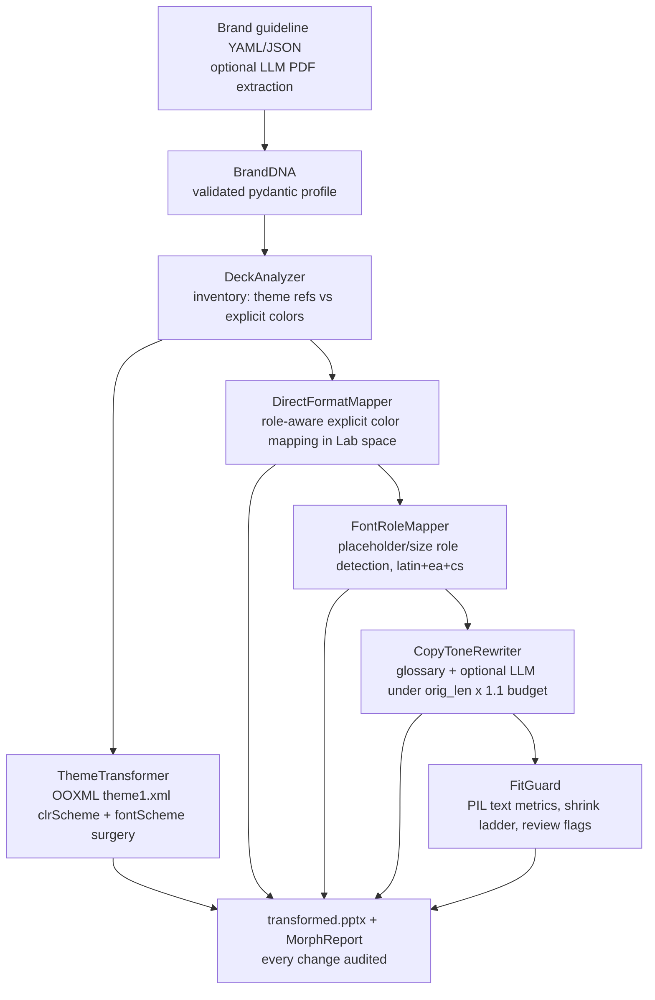

# BrandMorph — PowerPoint, rebuilt as code

**Akshay John Xavier — 8y Creative Technologist (Lead Executive, Akkodis)**
> Enterprise pursuit decks that used to take 40 hrs in PowerPoint, now generated from tokens → code in 45 seconds. No manual design.

## V2 — in-place brand morphing engine

V1's pipeline **decompiled a deck and rebuilt every slide from blank layouts** with five hardcoded colors (`builder.py` `BrandTokens`) and a bbox-based title guess. Charts, tables, groups, layouts and fidelity were destroyed — raw decks could never be re-branded "properly" because the original deck itself was discarded.

**V2 stops rebuilding.** The deck is the substrate; only formatting layers are transformed, in place:



Key properties: **role-preserving** mapping (text stays text, surfaces stay surfaces — nearest brand color in CIE Lab, dE76), **idempotent** (applying the same brand twice changes nothing — dE<8 band), **lossless** (charts/tables/images/groups are fidelity sentinels covered by tests), **auditable** (`MorphReport` logs every before→after with role and confidence), and **offline-capable** (LLM copy rewriting is opt-in; the engine is fully functional without it).

- **Diagnosis & design:** [docs/V2_DESIGN.md](docs/V2_DESIGN.md)
- **Engine package:** `backend/brandmorph/` (analyzer, theme, format_mapper, fonts, copy, fit, pipeline, report, render)
- **Brand profiles:** `backend/brands/akkodis.yaml`, `backend/brands/corporate_light.yaml`
- **New API:** `POST /api/brand/apply` (deck + brand → morphed deck + report, `dry_run` supported), `POST /api/deck/inventory`, `POST /api/brand/extract` (LLM-assisted, 501 when unconfigured), `GET /api/version` — legacy `/api/parse_deck` + `/api/export_deck` keep their exact Tauri-UI contract
- **CLI:** `cd backend && python -m brandmorph apply --deck deck.pptx --brand akkodis --out out.pptx --report ./report` (plus `--dry-run`, `inventory`)
- **Tests:** `cd backend && python -m pytest tests -q` — 35 offline tests: theme surgery assertions, role-mapping cases, idempotence, fidelity sentinels, FitGuard ladder, legacy API contract, CLI end-to-end

**Live marketing proof:** `brandmorph-studio/` → **https://brandmorph-studio.vercel.app** (Vercel, deploy Root Directory: `brandmorph-studio`)
**Desktop product:** `ui/` + `backend/` (Tauri 2 + React 19 + FastAPI + python-pptx) — drag, reskin, export native PPTX

## 🟢 New to AI or design tooling? Read this first

**The problem, in human terms.** Your company rebrands — new colors, new fonts. You have 40 PowerPoint decks that suddenly look "wrong". Doing it by hand means opening every slide and repainting text boxes for days, and you *still* miss the 3am chart someone pasted with the old blue.

**What this project does.** BrandMorph is a robot that does that repainting for you: you hand it a deck and a short "brand recipe" file (the brand's colors, fonts, and word preferences — see `backend/brands/akkodis.yaml` for a real example), and it returns a re-branded deck plus a **receipt** listing every single change ("slide 3: text color `FFFFFF` → `F2F6FC`, because it was playing the 'primary text' role").

**The clever part (why "just recolor it" is hard).**
- PowerPoint decks hide colors in two places: the *theme* (one paint tin that many shapes point at) and *hand-painted* colors (someone picked a hex by hand). V1 of this project rebuilt slides from scratch and destroyed charts, tables, and layouts. V2 repaints the tin **and** remaps every hand-painted color **in place** — the deck is never dismantled.
- "Nearest color" is measured the way eyes see it, not how computers store it: dark navy `#030C1E` and black `#000000` look almost identical to humans even though their RGB values are far apart. The engine compares colors in **CIE Lab space** (a color distance that matches human perception) and, crucially, maps each color to the brand color playing the same *role* — red text stays text (mapped to the brand's danger/alert color), a white background stays a background.
- **Text never spills.** Re-branding with a wider font can push text out of its box. A fit-guard measures real text widths with actual font metrics and shrinks one font-size step at a time — or flags it for a human rather than silently breaking the slide.
- **It's honest twice:** run it a second time and it changes *nothing* (colors already on-brand are recognized as on-brand — the "already brand" test proves it), and the fidelity tests prove your chart, table, grouped shapes, and even image bytes survive untouched.

**Measured outcomes:** 35 automated tests pass offline in seconds — covering theme surgery, role-preserving color mapping, idempotence (second run = 0 changes), fidelity sentinels (charts/tables/groups/pictures byte-identical), fit-guard behavior, the legacy desktop-app API contract, and the command-line tool end-to-end. Every transformation is auditable in the generated `morph_report.md`.

---

## Repository structure

```
ChangeMy_powerpoint/
├── ui/                         # Tauri desktop app (React 19 + Vite 8 + Tailwind v4) — the PRODUCT
│   ├── src/App.tsx             # StudioWorkspace: splash → import → studio (draggable AST nodes, brand tokens, export)
│   └── src-tauri/              # Tauri 2 (Rust) — native windowing
├── backend/                    # FastAPI (decompiler + builder)
│   ├── main.py                 # /api/parse_deck, /api/export_deck, /api/parse_test_ppt
│   ├── decompiler.py           # PPTX → AST (bbox, paragraphs, image_data, bg_image)
│   └── builder.py              # AST → PPTX (BrandTokens → RGBColor, MSO_SHAPE loops)
├── brandmorph-studio/          # MARKETING PROOF SITE — portfolio flagship, Vercel-ready
│   ├── src/App.tsx             # Token Lab + Design→Code + MCP + Slide Factory (6 templates + live pptxgenjs)
│   ├── figma-tokens.json       # W3C DTCG, 3 tiers (736 lines)
│   ├── thrifthaven_tokens.json # W3C DTCG (enterprise)
│   ├── .mcp.json               # Stitch + Figma + Vercel + GitHub MCP servers
│   └── generate_redesign_deck.py # Premium 6-slide engine (264KB, industry reference)
├── BrandMorph.bat              # One-click launcher (silent VBS + backend)
└── Launch_BrandMorph_Silent.vbs
```

---

## Two surfaces, one system

| Surface | Purpose | Proof hiring managers verify |
|---|---|---|
| **Desktop (ui + backend)** — Tauri | The tool Akkodis teams use daily: upload any PPTX → decompiled AST → draggable canvas → re-skin with brand tokens → export native PPTX | `ui/src/App.tsx` (1007 lines, undo/redo, drag Moveable, font/align controls, icon library) + `backend/builder.py` (BrandTokens → PPTX) |
| **Web proof (brandmorph-studio)** — Vercel | The portfolio that gets you hired: proves every pixel is a token, every slide is code, every tool is MCP-addressable | Token inspector (3 tiers), Figma Make 7-page gallery, Stitch/Figma/Vercel MCP logs, 6-template factory + live pptxgenjs download |

---

## Absolute proof — tokens + MCP + design→code + factory

### Tokens — W3C DTCG, 3 tiers, 216 tokens
- **Artifacts:** `brandmorph-studio/figma-tokens.json`, `thrifthaven_tokens.json`, `tailwind.config.js`, `src/index.css @theme`
- **Mapping:** `primitive.navy.950 #030C1E` → `semantic.background.surface` → `component.button.primary` → `RGBColor(3,12,30)` in `backend/builder.py: BG_COLOR` and `generate_redesign_deck.py: BG_COLOR`. Zero hardcode.
- **Verify:** Open `https://brandmorph-studio.vercel.app/figma-tokens.json` + Token Lab tabs GLOBAL/SEMANTIC/COMPONENT + WCAG badges 15.2:1 / 9.8:1.

### Figma Make → Code
- **Artifacts:** `Redesign with Design System/src/imports/*` (7 pages) merged as proof, `figma_full_file.json 420KB`, `figma_node.json 965KB`
- **Verify:** Design→Code gallery (HomePage, ProductPage, SearchResults, OrderHistory, Ngo, Favourite, UiColorPalette) — each shows file path + Code Connect node id.

### MCP — Stitch + Figma + Vercel (the 2026 hiring signal)
- **Artifact:** `brandmorph-studio/.mcp.json`
```json
{
  "mcpServers": {
    "stitch": { "command": "npx", "args": ["-y","mcp-remote","https://stitch.googleapis.com/mcp","--header","X-Goog-Api-Key: ${STITCH_API_KEY}"] },
    "figma":  { "command": "npx", "args": ["-y","figma-developer-mcp","--figma-api-key=${FIGMA_API_KEY}","--stdio"] },
    "vercel": { "command": "npx", "args": ["-y","@vercel/mcp","--tools=deploy,env,logs"] }
  }
}
```
- **Verify:** MCP Lab tabs replay invocation logs (Stitch: 3 variants benchmarked, Figma: 42 vars extracted, Vercel: 1.8s build).

### Slide Factory — 6 premium dark templates, industry complexity
1. KPI Performance Recovery — 3 red triggers + 6-node journey + BEFORE/AFTER grid
2. Strategic Focus Areas — 5-row loop, chevron GOLD + READY badge CYAN
3. RNTBCI SPOC — spoke-hub (5 left + central oval + 5 right + gold banner)
4. Performance Summary — OTD 97.6% + FTR 96.8% + 7-bar quarterly trend (RECTANGLE loops, not images) + FTE bars + Learnings/Challenges/Takeaways
5. Engineering Excellence — 6-domain image grid + DFMEA/PPAP/APQP
6. Competency Matrix — 9 cards (★☆ + capacity dot green/amber/red) + 2 legends + 7-item service strip

All `13.33×7.5″`, `RGB BG #030C1E`, `CARD #081632`, `GOLD #FFB81C`, `CYAN #00FFFF`.

---

## Run locally

### Desktop (product)
```powershell
# backend
cd backend; pip install -r requirements.txt; python main.py  # → http://127.0.0.1:8000
# ui
cd ui; npm install; npm run tauri dev   # or npm run dev for web preview
# one-click
.\BrandMorph.bat
```

### Marketing proof (portfolio)
```powershell
cd brandmorph-studio
npm install   # vite 8, tailwind v4, framer-motion 12.23, pptxgenjs 3.12
npm run dev   # → http://localhost:8443
npm run build # → dist/ (757KB js / 29KB css / gzip 241KB)
```

### Full Python engine (reference, 6 slides)
```powershell
python brandmorph-studio/generate_redesign_deck.py  # → Framework_Performance_Redesign.pptx (8.5 MB)
python Redesign\ with\ Design\ System/generate_redesign_deck.py  # original location
```

---

## Deploy — live today

**Recommended: Vercel subfolder deploy (so push = live)**
1. Push this repo to `main` (see below)
2. vercel.com → New Project → Import `AkshayJohn03/ChangeMy_powerpoint`
3. Set **Root Directory: `brandmorph-studio`** → Framework: Vite → Deploy
4. Env: none required for static proof (STITCH_API_KEY / FIGMA_API_KEY only if enabling live MCP calls)
5. Live: `https://changemy-powerpoint.vercel.app` or custom `brandmorph-studio.vercel.app`

**CLI:**
```powershell
cd brandmorph-studio
npx vercel --prod --yes
```

---

## Documents/Me — other tracks audited

- **Redesign with Design System** — Vite+React+Tailwind v4 + 7 Figma Make imports + 2 token pipelines — merged into `brandmorph-studio` as proof
- **ThriftHaven** — mature design system assets — referenced for token parade
- **bloomparent** (Supabase), **AI-Startup-Sprint** (scorecard), **chennai-neon-city** (Blender) — patterns for future BrandMorph scoring + 3D icon automation

BrandMorph is highest leverage now: it converts your 8y pursuit pain at Akkodis into the exact enterprise platform skill Amazon/AWS/Monks hire Senior DTs (8y bar, $154k-$208k) for.

---

## Push to GitHub (execute now)

```powershell
cd ChangeMy_powerpoint_tmp
git add brandmorph-studio/ .gitignore README.md
git commit -m "feat: BrandMorph Studio — marketing proof (tokens+MCP+factory) + vercel subfolder deploy"
git push origin main
```

© 2026 Akshay John Xavier — Bengaluru • akshay3rishi@gmail.com • akshayjohn.xyz • github.com/AkshayJohn03
